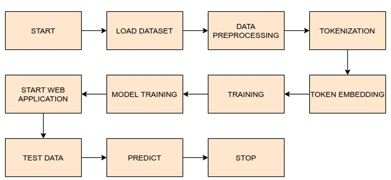

# named_entity_recognition

Named EntitiesRecognition (NER) is a basic task of Natural Language Processing (NLP). The purpose is to identify named entities such as person names, place names, and organization names in the corpus. Due to the increasing number of these named entities, it is usually impossible to exhaustively list them in the dictionary, and their constituent methods have some regularities. Therefore, the recognition of these words is usually included in the task of morphological processing (such as Chinese segmentation). Independent processing, called named entity recognition. 

 

## Workflow

## Prediction

